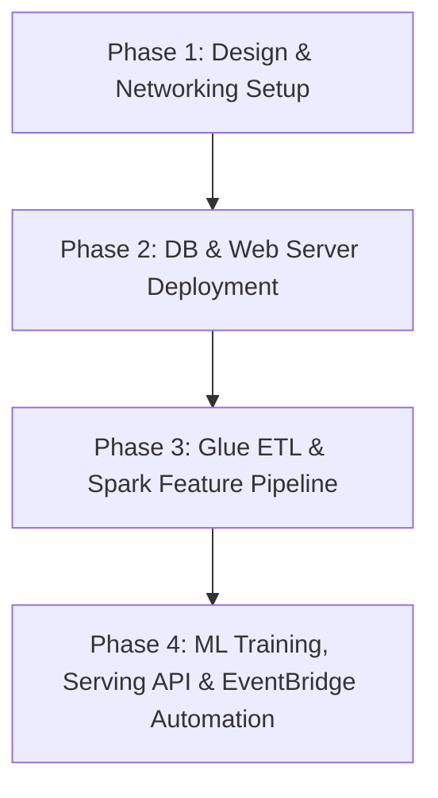

# Cloud-Native Fashion Retail Web Application & Automated ML Sales Forecasting Pipeline

---

## 1. Project Overview

This proposal presents the design and end-to-end implementation of a **cloud-native, high-availability e-commerce retail web application** integrated with an **automated machine learning forecasting pipeline** on AWS. The platform, named **"Cloud-Native Fashion Retail Web Application & Automated ML Sales Forecasting Pipeline,"** is designed to address two primary business and technical requirements:

1. **High-Availability Storefront & Scalable APIs**: The storefront runs on auto-scaling EC2 web application instances fronted by an Application Load Balancer (ALB) and CloudFront CDN, ensuring smooth checkout processes and low-latency image loading even during traffic surges.
2. **Automated ML-Powered Inventory Optimization**: Transaction records from the main database are periodically extracted, cleaned, and processed into lag and velocity features using AWS Glue. An isolated machine learning instance trains forecasting models to predict demand, which is served via a serverless AWS Lambda endpoint to prevent stockouts and overstocking.

The entire pipeline is orchestrated to run daily via Amazon EventBridge, ensuring the forecasting model is always up to date with the latest sales transactions.

> 📌 **System Architecture Diagram:**
>
> 

**Platform at a glance:**

| Dimension | Detail |
|-----------|--------|
| **Use Case** | E-commerce storefront web application and automated retail sales forecasting |
| **Compute Layer** | Amazon EC2 (Web & API Auto Scaling Groups), Amazon EC2 (ML-Forecast-Server) |
| **Traffic Routing** | Amazon CloudFront (CDN) + External ALB + Internal ALB |
| **Databases** | Central RDS PostgreSQL (`fashion-rds`) + Feature RDS PostgreSQL (`training-db`) |
| **Data Processing** | AWS Glue ETL (Python Shell for extraction, PySpark for feature engineering) |
| **Storage Layer** | Amazon S3 (`fashion-retail-model-storage` and ETL landing zones) |
| **Forecast Serving** | AWS Lambda + Amazon API Gateway (Serverless Prediction Endpoint) |
| **Orchestration** | Amazon EventBridge Scheduler (Daily triggers) |
| **Monitoring** | Amazon CloudWatch dashboards and alarms |

---

## 2. Objectives

The project is designed to achieve the following measurable objectives:

### 2.1. Technical Objectives

* **O1 - High-Availability Storefront & Isolated APIs:**
  Deploy Web Application and RESTful API microservices across multiple Availability Zones under Auto Scaling Groups, with external and internal ALBs to handle load and secure traffic routing.
* **O2 - Isolated Transactional & Feature Databases:**
  Deploy two distinct Amazon RDS PostgreSQL instances: `fashion-rds` to handle production OLTP storefront transactions, and `training-db` to store calculated machine learning feature tables, isolating analytical load from the customer storefront database.
* **O3 - Automated Spark-based Feature Extraction:**
  Implement two sequential AWS Glue ETL jobs: `de-fashion-rds-extract` (Python Shell to extract transactions to S3 landing zone) and `glue_feature_engineering.py` (PySpark to calculate lag sales, rolling averages, and velocities) to update `training-db` daily.
* **O4 - Automated ML Training & Storage:**
  Configure a dedicated `ML-Forecast-Server` (EC2) that triggers daily to load features from `training-db`, train a LightGBM/XGBoost regressor model, and save model artifacts inside an Amazon S3 bucket.
* **O5 - Serverless Prediction Endpoint:**
  Expose a low-cost, serverless forecast API using AWS Lambda and API Gateway that pulls model artifacts from S3 and returns sales forecasts dynamically.
* **O6 - Event-Driven Orchestration & Monitoring:**
  Automate the entire end-to-end data extraction, feature engineering, and model training pipeline using Amazon EventBridge Scheduler, with CloudWatch alerts for failures.

### 2.2. Learning Objectives

Beyond the technical deliverables, this project serves as a hands-on learning experience to master:

| Skill Area | AWS Services / Tools |
|------------|---------------------|
| High-Availability Compute | Amazon EC2, ALB, Auto Scaling |
| Production Databases | Amazon RDS PostgreSQL |
| Big Data & Serverless ETL | AWS Glue (PySpark, Python Shell) |
| Model Lifecycle & Storage | Amazon S3, Scikit-learn, XGBoost |
| Serverless API Serving | AWS Lambda, Amazon API Gateway |
| Workflow Automation | Amazon EventBridge Scheduler |
| Cloud Security | AWS IAM (least-privilege policies), VPC Security Groups |

---

## 3. Problem Statement

### 3.1. Business Context

In the modern fashion retail industry, matching supply with consumer demand is a critical operational challenge. Retailers must manage inventory carefully to avoid two costly extremes:
1. **Stockouts**: Running out of popular items, leading to lost revenue and customer dissatisfaction.
2. **Overstocking**: Holding excess inventory, causing high storage costs and eventual write-offs or heavy discounting.

To solve this, fashion retail storefronts need a reliable forecasting pipeline that uses transaction history to predict demand at the SKU-store level. However, deploying a machine learning forecasting system is complex and expensive when coupled directly with customer-facing web environments.

### 3.2. Core Problems

* **Problem 1 - High Traffic & Storefront Scaling**
  Storefront applications experience volatile user traffic (surges during holidays or promotions). A non-scalable, single-instance setup will crash or experience severe latency, hurting sales.
* **Problem 2 - Database Load from Analytical Queries**
  Extracting features and historical transactions directly from a production transactional database (OLTP) for ML training can lock tables and slow down the storefront checkout process.
* **Problem 3 - Complex Feature Engineering at Scale**
  Sales forecasting requires calculating complex time-series features (e.g., 7-day lags, 30-day rolling averages, and sales velocity) across thousands of SKUs, which is computationally expensive for standard relational databases.
* **Problem 4 - Idle Server Costs for Model Serving**
  Running a dedicated, 24/7 web server just to host forecasting models is highly inefficient and expensive when prediction queries only occur occasionally.
* **Problem 5 - Manual Pipelines & Outdated Models**
  Manually triggering ETL, training models, and copying files is error-prone. Without automation, forecasting models quickly become outdated as consumer buying habits shift daily.

### 3.3. Why This Matters

Failing to resolve these problems leads to a system that is:
* **Fragile**: Highly prone to crashes under traffic spikes or during database extraction runs.
* **Inaccurate**: Serving forecasts based on stale data because model updates are manual and irregular.
* **Expensive**: Incurring high fixed costs for running unused compute servers 24/7.

This proposal designs a modern, decoupled, auto-scaling, and event-driven architecture on AWS to address all five problems efficiently.

---

## 4. Solution Architecture

### 4.1. Architecture Overview

The solution consists of **six functional layers** that separate storefront traffic from analytical processing:

| Layer | AWS Services | Responsibility |
|-------|-------------|---------------|
| **User Access & Delivery** | CloudFront, External ALB | Caching static content and load balancing storefront requests |
| **Web Storefront (Compute)** | EC2 Auto Scaling (Web & API) | Hosting the customer web portal and REST APIs |
| **Production Databases** | Amazon RDS PostgreSQL (`fashion-rds`) | Storing order transactions, user data, and stock info |
| **Data Ingestion & ETL** | AWS Glue (Python Shell & PySpark), S3 | Extracting data and engineering time-series features |
| **ML Training & Storage** | EC2 (`ML-Forecast-Server`), S3 | Executing daily model training and storing artifacts |
| **Serving & Orchestration** | AWS Lambda, API Gateway, EventBridge | Exposing the forecast API and automating the daily pipeline |

---

### 4.2. Detailed Layer Operations

#### 1. Web Application & API Group (User Access Layer)
* **Amazon CloudFront** caches static images, styles, and scripts globally, minimizing loading times and reducing hits on the backend.
* **External ALB** handles public HTTPS traffic and distributes it across the **Web Application Auto Scaling Group** (EC2 instances running the customer portal).
* **Internal ALB** acts as an internal gateway, taking internal API requests from the Web Application servers and distributing them to the **RESTful API Auto Scaling Group** (EC2 instances handling checkout and payment logic).

#### 2. Database Layer
* **`fashion-rds`** handles OLTP transactions. Under-the-hood schema separation prevents analytical queries from locking transactional tables.
* **`training-db`** stores pre-calculated features. It is completely decoupled from `fashion-rds`, so ML training jobs do not affect web performance.

#### 3. Ingestion & Feature Engineering Layer
* **`de-fashion-rds-extract` (AWS Glue Python Shell)**: Runs daily, extracting transaction records from `fashion-rds` and exporting them as compressed Parquet files to an S3 staging prefix.
* **`glue_feature_engineering.py` (AWS Glue PySpark)**: Reads Parquet files from S3, computes 7-day lags, rolling averages, and sales velocities, and writes the structured features into the isolated `training-db` RDS instance.

#### 4. Model Training & Storage
* **`ML-Forecast-Server` (EC2)**: Automatically starts, reads the feature tables from `training-db`, trains the forecasting model, uploads the finalized model artifacts to the `fashion-retail-model-storage` S3 bucket, and shuts down to save costs.

#### 5. Forecast API & Orchestration
* **AWS Lambda & API Gateway**: A serverless forecast API. When requested, Lambda retrieves the model from S3, predicts the sales forecast, and returns it.
* **Amazon EventBridge**: Triggers the Daily ETL and model retraining jobs sequentially every night.

---

## 5. Technical Implementation

### 5.1. Implementation Phases

The project implementation is divided into four main phases:

1. **Phase 1: Networking & IAM Security Setup**
   * Create public and private subnets across multiple Availability Zones.
   * Configure Security Groups and IAM least-privilege roles for EC2, Glue, and Lambda.
2. **Phase 2: Database & Web Storefront Deployment**
   * Provision RDS PostgreSQL databases (`fashion-rds` and `training-db`).
   * Setup Web Application and API Auto Scaling Groups with Load Balancers.
3. **Phase 3: AWS Glue ETL Pipeline Development**
   * Write and deploy `de-fashion-rds-extract` to dump data to S3.
   * Write and deploy the PySpark `glue_feature_engineering.py` script.
4. **Phase 4: ML Training, Serving API & Automation**
   * Setup `ML-Forecast-Server` (EC2) with training scripts.
   * Develop and deploy the AWS Lambda prediction endpoint.
   * Configure EventBridge Scheduler rules for daily pipeline automation.

### 5.2. Technical Requirements

* **Infrastructure**: AWS VPC, Security Groups, IAM Roles, CloudFront.
* **Web Hosting**: EC2 Auto Scaling (Web & API servers), Application Load Balancers.
* **Database**: Amazon RDS PostgreSQL (OLTP and OLAP feature store).
* **Big Data & ETL**: AWS Glue (Python Shell, Spark), PySpark, S3, Apache Parquet.
* **Machine Learning**: Python, Pandas, Scikit-learn, XGBoost / LightGBM, AWS Lambda, API Gateway.

---

## 6. Timeline & Milestones

The internship project follows a structured 12-week timeline:

* **Weeks 1-3: Architecture Design & Network Setup**
  * Design network topologies (VPC, public/private subnets).
  * Build database schemas and configure RDS instances.
* **Weeks 4-6: Web Application & DB Integration**
  * Deploy web storefront and API servers under Auto Scaling Groups.
  * Verify internal and external load balancing.
* **Weeks 7-9: Big Data ETL & Feature Pipeline**
  * Create AWS Glue jobs.
  * Implement PySpark script to calculate rolling averages, lags, and velocities.
* **Weeks 10-12: ML Training, API Integration, and Scheduling**
  * Deploy the model training script on `ML-Forecast-Server`.
  * Deploy the prediction API via Lambda and API Gateway.
  * Automate the daily run via EventBridge Scheduler and perform resource cleanups.

---

## 7. Budget Estimation

Estimated monthly infrastructure costs for the internship scale:

| AWS Service | Configuration | Monthly Cost |
|-------------|---------------|--------------|
| **Amazon EC2** | 2x t3.micro (Web storefront Auto Scaling), 2x t3.micro (API Auto Scaling), 1x t3.small (ML Server - active 1 hr/day) | $17.50 |
| **Amazon RDS** | 2x db.t3.micro (PostgreSQL - 1x for storefront, 1x for features) | $14.80 |
| **AWS Glue** | 1 DPU for Python Shell, 2 DPUs for Spark Job (run 30 mins daily) | $2.40 |
| **Amazon S3** | 10 GB Standard storage + PUT/GET requests | $0.35 |
| **AWS Lambda** | 128 MB RAM (10,000 invocations/month) | $0.00 (Free Tier) |
| **API Gateway** | 10,000 HTTP API requests | $0.05 |
| **CloudFront & ALB**| Caching static assets + 2x ALBs with minimal LCU usage | $6.50 |
| **Total** | | **~$41.60 / month** |

---

## 8. Risk Assessment

### 8.1. Risk Matrix

| Risk Identified | Impact | Probability | Mitigation Strategy |
|-----------------|--------|-------------|---------------------|
| **Database Connection Failures** | High | Low | Implement connection pooling and retry logic inside Glue and application servers. |
| **Data Drift & Stale Forecasts**| Medium | Medium | Automated daily retraining via EventBridge ensures the model uses the latest transaction data. |
| **Cost Overruns** | Medium | Medium | Configure CloudWatch Billing Alerts and S3 Lifecycle policies to clean up old datasets. |
| **Instance Outages** | High | Low | Deploy EC2 instances in an Auto Scaling Group across multiple Availability Zones. |

### 8.2. Contingency Plans

* If AWS Glue ETL fails, the system reverts to using the previous day's pre-calculated features in `training-db` to serve predictions.
* In case of `ML-Forecast-Server` EC2 failure, Lambda serves predictions using the latest working model version backed up in the S3 bucket.

---

## 9. Expected Outcomes

### 9.1. Technical Improvements
* **Decoupled Architecture**: Separation of web storefront transactions (`fashion-rds`) from training data (`training-db`) ensures excellent web application performance.
* **Auto-Scaling compute**: Front-end storefront automatically handles traffic spikes.
* **Automated MLOps Pipeline**: End-to-end extraction, engineering, training, and deployment are done without manual human intervention.

### 9.2. Business Value
* **Improved Inventory Accuracy**: High-quality SKU-store forecasts reduce stockouts and prevent cash flow lockup in overstocked warehouses.
* **High Customer Satisfaction**: Smooth and highly available storefront checkout experience leads to increased user retention.