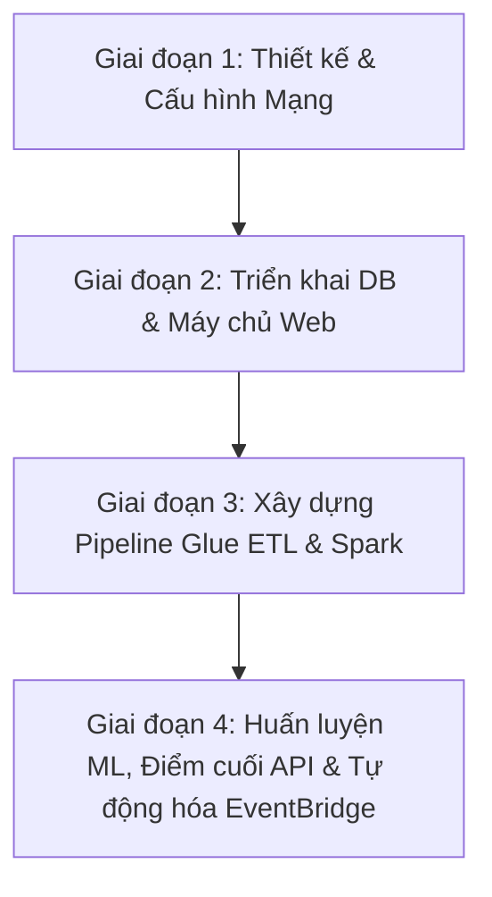

# Kiến trúc Ứng dụng Web Fashion Retail & Pipeline Học Máy tự động cho Dự báo Doanh thu trên Cloud-Native AWS

---

## 1. Tổng quan dự án

Bản đề xuất này trình bày thiết kế và triển khai end-to-end một **ứng dụng web thương mại điện tử có tính sẵn sàng cao** tích hợp với một **pipeline học máy (machine learning) tự động để dự báo doanh số bán hàng** trên nền tảng AWS. Hệ thống được đặt tên là **"Cloud-Native Fashion Retail Web Application & Automated ML Sales Forecasting Pipeline"** nhằm phản ánh hai yêu cầu kinh doanh và kỹ thuật cốt lõi:

1. **Giao diện Web Cửa hàng & API có tính sẵn sàng cao**: Web storefront hoạt động trên các thực thể EC2 tự động co giãn (Auto Scaling Groups) nằm sau Application Load Balancer (ALB) và CloudFront CDN, đảm bảo quy trình mua sắm, thanh toán diễn ra mượt mà và tải hình ảnh sản phẩm với độ trễ thấp ngay cả trong các khung giờ cao điểm.
2. **Tối ưu hóa Kho hàng tự động bằng Học Máy**: Các bản ghi giao dịch từ cơ sở dữ liệu chính được định kỳ trích xuất, làm sạch và biến đổi thành các đặc trưng trễ (lags) và vận tốc bán hàng qua dịch vụ AWS Glue. Một thực thể máy chủ học máy độc lập sẽ tự động huấn luyện mô hình dự báo nhu cầu mua sắm và cung cấp kết quả thông qua điểm cuối (endpoint) serverless AWS Lambda, giúp doanh nghiệp ngăn chặn tình trạng cạn kiệt kho hàng (stockouts) hoặc tồn kho quá mức (overstocking).

Toàn bộ pipeline được điều phối tự động chạy hàng ngày qua Amazon EventBridge, đảm bảo mô hình dự báo luôn được cập nhật dựa trên dữ liệu giao dịch mới nhất.

> 📌 **Sơ đồ kiến trúc tổng thể:**
>
> 

**Tổng quan nền tảng:**

| Chiều kích | Chi tiết |
|------------|----------|
| **Use Case** | Ứng dụng web bán lẻ thời trang & pipeline học máy tự động dự báo doanh số |
| **Lớp Compute** | Amazon EC2 (Auto Scaling Groups cho Web & API), Amazon EC2 (ML-Forecast-Server) |
| **Định tuyến lưu lượng**| Amazon CloudFront (CDN) + ALB bên ngoài (External) + ALB bên trong (Internal) |
| **Cơ sở dữ liệu** | RDS PostgreSQL trung tâm (`fashion-rds`) + RDS PostgreSQL lưu đặc trưng (`training-db`) |
| **Xử lý dữ liệu** | AWS Glue ETL (Python Shell cho trích xuất, PySpark cho kỹ thuật đặc trưng) |
| **Lớp Lưu trữ** | Amazon S3 (`fashion-retail-model-storage` và vùng đệm ETL) |
| **Cung cấp dự báo** | AWS Lambda + Amazon API Gateway (Prediction Endpoint không máy chủ) |
| **Điều phối** | Amazon EventBridge Scheduler (Lịch chạy hàng ngày) |
| **Giám sát** | Amazon CloudWatch dashboards và alarms |

---

## 2. Mục tiêu

Dự án được thiết kế nhằm đạt được các mục tiêu cụ thể và đo lường được sau đây:

### 2.1. Mục tiêu kỹ thuật

* **MT1 - Giao diện Web Cửa hàng & API có tính sẵn sàng cao:**
  Triển khai các microservice Web Storefront và RESTful API trên nhiều Availability Zone khác nhau dưới sự quản lý của Auto Scaling Groups, sử dụng ALB bên ngoài và bên trong để cân bằng tải và định tuyến lưu lượng an toàn.
* **MT2 - Tách biệt Cơ sở dữ liệu Giao dịch và Cơ sở dữ liệu Đặc trưng:**
  Triển khai hai thực thể Amazon RDS PostgreSQL riêng biệt: `fashion-rds` xử lý giao dịch sản xuất (OLTP) của khách hàng, và `training-db` lưu trữ các bảng đặc trưng phục vụ học máy, tránh tình trạng quá tải cho cơ sở dữ liệu giao dịch chính khi thực hiện các tác vụ phân tích.
* **MT3 - Pipeline trích xuất đặc trưng tự động dựa trên Spark:**
  Thiết lập hai công việc AWS Glue chạy tuần tự: `de-fashion-rds-extract` (Python Shell trích xuất dữ liệu giao dịch thô sang vùng đệm S3) và `glue_feature_engineering.py` (PySpark tính toán lag 7 ngày, trung bình trượt và vận tốc bán hàng) để cập nhật đặc trưng vào `training-db` hàng ngày.
* **MT4 - Tự động hóa Huấn luyện & Lưu trữ Mô hình:**
  Cấu hình máy chủ huấn luyện độc lập `ML-Forecast-Server` (EC2) tự động khởi chạy mỗi ngày để lấy dữ liệu từ `training-db`, huấn luyện mô hình dự báo hồi quy (XGBoost/LightGBM), lưu trữ kết quả (model artifacts) vào Amazon S3 và tự động tắt sau khi hoàn thành.
* **MT5 - Điểm cuối Dự báo không máy chủ (Serverless API):**
  Cung cấp API dự báo doanh thu thời gian thực với chi phí tối ưu, sử dụng kết hợp AWS Lambda và API Gateway để tải mô hình từ S3 và thực hiện suy luận động khi có yêu cầu.
* **MT6 - Điều phối & Giám sát theo hướng Sự kiện:**
  Tự động hóa toàn bộ quy trình trích xuất dữ liệu, tính toán đặc trưng và huấn luyện mô hình định kỳ hàng ngày bằng Amazon EventBridge Scheduler, đi kèm hệ thống cảnh báo lỗi thông qua CloudWatch.

### 2.2. Mục tiêu học tập

Bên cạnh các deliverable về mặt kỹ thuật, dự án này là cơ hội thực hành thực tế giúp các sinh viên thực tập phát triển năng lực:

| Lĩnh vực kỹ năng | Dịch vụ AWS / Công cụ |
|-----------------|----------------------|
| Tính toán sẵn sàng cao | Amazon EC2, ALB, Auto Scaling |
| Cơ sở dữ liệu sản xuất | Amazon RDS PostgreSQL |
| Xử lý Dữ liệu lớn & Serverless ETL | AWS Glue (PySpark, Python Shell) |
| Vòng đời mô hình & Lưu trữ | Amazon S3, Scikit-learn, XGBoost |
| Cung cấp API không máy chủ | AWS Lambda, Amazon API Gateway |
| Tự động hóa quy trình | Amazon EventBridge Scheduler |
| Bảo mật điện toán đám mây | AWS IAM (least-privilege policies), VPC Security Groups |

---

## 3. Vấn đề cần giải quyết

### 3.1. Bối cảnh kinh doanh

Trong ngành bán lẻ thời trang hiện đại, việc cân đối giữa cung và cầu là một thách thức lớn trong khâu vận hành. Doanh nghiệp bán lẻ luôn phải đối mặt với hai rủi ro lớn gây tổn thất tài chính:
1. **Cạn kiệt kho hàng (Stockouts)**: Hết các sản phẩm thịnh hành khiến doanh nghiệp bỏ lỡ cơ hội tạo doanh thu và làm giảm mức độ hài lòng của khách hàng.
2. **Tồn kho quá mức (Overstocking)**: Giữ quá nhiều hàng hóa trong kho làm tăng chi phí lưu kho, đọng vốn và buộc phải thanh lý lỗ hoặc tiêu hủy sản phẩm.

Để giải quyết vấn đề này, cửa hàng bán lẻ thời trang cần một pipeline dự báo nhu cầu mua sắm ở cấp độ SKU-Cửa hàng dựa trên lịch sử giao dịch. Tuy nhiên, việc tích hợp trực tiếp một hệ thống học máy vào môi trường ứng dụng web bán hàng thường rất phức tạp và tốn kém tài nguyên.

### 3.2. Năm vấn đề cốt lõi

* **Vấn đề 1 - Lưu lượng truy cập biến động lớn và sự co giãn của web cửa hàng**
  Ứng dụng web cửa hàng thường xuyên đối mặt với lưu lượng truy cập không ổn định (tăng đột biến vào dịp lễ tết hoặc các chương trình khuyến mãi). Thiết lập máy chủ đơn lẻ không co giãn sẽ dễ dàng bị sập hoặc gặp độ trễ lớn, gây thất thoát doanh số.
* **Vấn đề 2 - Tải nặng trên cơ sở dữ liệu giao dịch từ các truy vấn phân tích**
  Việc chạy các câu lệnh truy vấn phân tích nặng hoặc trích xuất hàng triệu bản ghi giao dịch trực tiếp từ cơ sở dữ liệu giao dịch sản xuất (OLTP) để huấn luyện mô hình có thể gây khóa bảng và làm chậm hệ thống thanh toán của khách hàng.
* **Vấn đề 3 - Kỹ thuật đặc trưng phức tạp ở quy mô lớn**
  Để dự báo doanh số chính xác, hệ thống phải tính toán các đặc trưng chuỗi thời gian phức tạp (ví dụ: lag 7 ngày, trung bình trượt 30 ngày, vận tốc bán hàng) trên hàng nghìn SKU sản phẩm khác nhau. Tác vụ này tiêu tốn rất nhiều tài nguyên tính toán và vượt quá khả năng xử lý hiệu quả của các cơ sở dữ liệu quan hệ thông thường.
* **Vấn đề 4 - Chi phí máy chủ nhàn rỗi để phục vụ mô hình**
  Duy trì một máy chủ chạy liên tục 24/7 chỉ để chờ các yêu cầu gọi API dự báo doanh số là cực kỳ lãng phí và đắt đỏ, đặc biệt khi các yêu cầu dự báo này chỉ diễn ra định kỳ hoặc không thường xuyên.
* **Vấn đề 5 - Vận hành pipeline thủ công và mô hình bị lỗi thời**
  Việc kích hoạt ETL, huấn luyện mô hình và di chuyển tệp tin bằng tay rất dễ xảy ra sai sót. Nếu không có cơ chế tự động hóa, mô hình dự báo sẽ nhanh chóng bị lỗi thời do thói quen mua sắm của khách hàng thay đổi hàng ngày.

### 3.3. Tại sao điều này quan trọng

Nếu không giải quyết được năm vấn đề trên, hệ thống sẽ rơi vào trạng thái:
* **Dễ sập**: Thường xuyên gặp sự cố khi lưu lượng truy cập tăng cao hoặc khi chạy tác vụ trích xuất dữ liệu.
* **Không chính xác**: Cung cấp dự báo dựa trên dữ liệu cũ do mô hình không được huấn luyện lại đều đặn.
* **Tốn kém**: Phát sinh chi phí cố định lớn cho các tài nguyên máy chủ chạy nhàn rỗi 24/7.

Bản đề xuất này cung cấp một kiến trúc tách biệt, tự động co giãn và hoạt động theo hướng sự kiện trên AWS để giải quyết triệt để các thách thức trên.

---

## 4. Kiến trúc giải pháp

### 4.1. Tổng quan kiến trúc

Giải pháp được tổ chức thành **sáu lớp chức năng** giúp tách biệt hoàn toàn lưu lượng truy cập của khách hàng khỏi các tác vụ xử lý phân tích học máy nặng:

| Lớp chức năng | Dịch vụ AWS sử dụng | Trách nhiệm chính |
|---------------|---------------------|-------------------|
| **Truy cập & Phân phối** | CloudFront, External ALB | Caching nội dung tĩnh và cân bằng tải yêu cầu của người dùng |
| **Storefront Web (Compute)** | EC2 Auto Scaling (Web & API) | Lưu trữ mã nguồn website và cung cấp các dịch vụ REST API |
| **Cơ sở dữ liệu sản xuất**| Amazon RDS PostgreSQL (`fashion-rds`) | Lưu trữ giao dịch đặt hàng, thông tin người dùng và hàng tồn kho |
| **Tiếp nhận dữ liệu & ETL** | AWS Glue (Python Shell & Spark), S3 | Trích xuất dữ liệu giao dịch và tính toán đặc trưng chuỗi thời gian |
| **Huấn luyện ML & Lưu trữ** | EC2 (`ML-Forecast-Server`), S3 | Tự động chạy huấn luyện mô hình hàng ngày và lưu trữ kết quả |
| **Cung cấp API & Điều phối**| AWS Lambda, API Gateway, EventBridge| Điểm cuối dự báo serverless và tự động hóa lịch trình pipeline |

---

### 4.2. Chi tiết hoạt động các lớp

#### 1. Nhóm Ứng dụng Web & API (Lớp truy cập người dùng)
* **Amazon CloudFront** đóng vai trò CDN lưu trữ đệm các tệp hình ảnh sản phẩm, CSS, JS trên toàn cầu, giúp giảm thời gian tải trang và giảm thiểu yêu cầu gửi trực tiếp đến máy chủ gốc.
* **External ALB** tiếp nhận lưu lượng HTTPS công khai từ người dùng và phân phối đều tới các thực thể trong **Web Application Auto Scaling Group** (EC2 chạy giao diện cửa hàng).
* **Internal ALB** đóng vai trò cổng bảo mật bên trong, tiếp nhận API call từ Web App chuyển đến **RESTful API Auto Scaling Group** (EC2 xử lý giỏ hàng, thanh toán và thông tin cá nhân).

#### 2. Lớp Cơ sở dữ liệu
* **`fashion-rds`** phục vụ tác vụ OLTP giao dịch hàng ngày. Cấu trúc bảng và phân quyền được tối ưu hóa để không bị ảnh hưởng bởi quá trình trích xuất.
* **`training-db`** lưu trữ các bảng đặc trưng đã tính toán xong. Cơ sở dữ liệu này hoàn toàn độc lập với database sản xuất, đảm bảo việc truy cập dữ liệu học máy không làm chậm website.

#### 3. Lớp Tiếp nhận dữ liệu & Kỹ thuật đặc trưng (ETL)
* **`de-fashion-rds-extract` (AWS Glue Python Shell)**: Chạy hàng ngày để lấy dữ liệu giao dịch từ `fashion-rds` và đẩy sang lưu trữ dưới dạng Parquet nén trên S3 landing zone.
* **`glue_feature_engineering.py` (AWS Glue PySpark)**: Đọc tệp Parquet từ S3, thực hiện tính toán song song các chỉ số lag 7 ngày, trung bình trượt và vận tốc bán hàng, sau đó ghi các đặc trưng này vào cơ sở dữ liệu độc lập `training-db`.

#### 4. Huấn luyện & Lưu trữ Mô hình
* **`ML-Forecast-Server` (EC2)**: Được thiết lập tự động khởi động vào ban đêm, đọc bảng đặc trưng từ `training-db`, chạy mã huấn luyện mô hình hồi quy, tải sản phẩm mô hình (model artifacts) lên S3 bucket `fashion-retail-model-storage` và tự động tắt máy.

#### 5. Cung cấp API Dự báo & Điều phối
* **AWS Lambda & API Gateway**: Điểm cuối API serverless. Khi nhận yêu cầu dự báo, Lambda tải mô hình mới nhất từ S3 về để dự đoán doanh số và trả kết quả ngay lập tức.
* **Amazon EventBridge**: Điều phối chạy tuần tự các job Glue ETL và job huấn luyện ML vào mỗi đêm mà không cần can thiệp thủ công.

---

## 5. Triển khai kỹ thuật

### 5.1. Các giai đoạn triển khai

Dự án được chia thành 4 giai đoạn triển khai chính:

1. **Giai đoạn 1: Cấu hình Mạng & Bảo mật IAM**
   * Thiết lập VPC, tạo các subnet công khai và riêng tư trên nhiều Availability Zone.
   * Cấu hình Security Groups và phân quyền IAM theo nguyên tắc quyền tối thiểu cho EC2, Glue và Lambda.
2. **Giai đoạn 2: Triển khai Cơ sở dữ liệu & Máy chủ Web**
   * Khởi tạo các cơ sở dữ liệu RDS PostgreSQL (`fashion-rds` và `training-db`).
   * Triển khai Web App và API server chạy dưới Auto Scaling Groups nằm sau các ALB tương ứng.
3. **Giai đoạn 3: Xây dựng Pipeline AWS Glue ETL**
   * Lập trình và deploy job Glue Python Shell `de-fashion-rds-extract` để đẩy dữ liệu thô sang S3.
   * Lập trình và deploy job Glue PySpark `glue_feature_engineering.py` để tính toán đặc trưng.
4. **Giai đoạn 4: Huấn luyện ML, API Dự báo & Tự động hóa**
   * Triển khai mã huấn luyện dự báo trên thực thể EC2 `ML-Forecast-Server`.
   * Lập trình và deploy hàm AWS Lambda xử lý yêu cầu API dự báo.
   * Thiết lập lịch trình EventBridge Scheduler để kích hoạt pipeline tự động hàng ngày.

### 5.2. Yêu cầu kỹ thuật

* **Hạ tầng**: AWS VPC, Security Groups, IAM Roles, CloudFront.
* **Web Hosting**: EC2 Auto Scaling, Application Load Balancers.
* **Cơ sở dữ liệu**: Amazon RDS PostgreSQL (OLTP và OLAP feature store).
* **Xử lý Dữ liệu lớn**: AWS Glue (Python Shell, Spark), PySpark, S3, Apache Parquet.
* **Học máy & API**: Python, Pandas, Scikit-learn, XGBoost / LightGBM, AWS Lambda, API Gateway.

---

## 6. Lộ trình & Mốc triển khai

Dự án thực tập kéo dài trong 12 tuần với các mốc thời gian cụ thể:

* **Tuần 1-3: Thiết kế Kiến trúc & Thiết lập Mạng**
  * Thiết kế sơ đồ mạng (VPC, public/private subnets).
  * Thiết kế schema cơ sở dữ liệu và khởi tạo các thực thể RDS PostgreSQL.
* **Tuần 4-6: Triển khai Ứng dụng Web & Tích hợp DB**
  * Triển khai máy chủ web storefront và API server dưới Auto Scaling Groups.
  * Kiểm thử khả năng cân bằng tải của các bộ ALB.
* **Tuần 7-9: Xây dựng Pipeline ETL Dữ liệu lớn**
  * Tạo các job AWS Glue.
  * Triển khai script PySpark để tính toán trung bình trượt, lag và vận tốc bán hàng.
* **Tuần 10-12: Huấn luyện Mô hình, Tích hợp API & Tự động hóa**
  * Triển khai mã huấn luyện dự báo trên `ML-Forecast-Server`.
  * Triển khai API dự báo qua AWS Lambda và API Gateway.
  * Tự động hóa quy trình chạy hàng ngày qua EventBridge Scheduler và dọn dẹp tài nguyên.

---

## 7. Ước tính ngân sách

Ước tính chi phí hạ tầng hàng tháng ở quy mô thực tập:

| Dịch vụ AWS | Cấu hình sử dụng | Chi phí hàng tháng |
|-------------|------------------|--------------------|
| **Amazon EC2** | 2x t3.micro (Web Auto Scaling), 2x t3.micro (API Auto Scaling), 1x t3.small (ML Server - chạy 1 giờ/ngày) | 17.50 USD |
| **Amazon RDS** | 2x db.t3.micro (PostgreSQL - 1x cho storefront, 1x cho features) | 14.80 USD |
| **AWS Glue** | 1 DPU cho Python Shell, 2 DPUs cho Spark Job (chạy 30 phút/ngày) | 2.40 USD |
| **Amazon S3** | 10 GB Standard storage + các yêu cầu đọc/ghi | 0.35 USD |
| **AWS Lambda** | 128 MB RAM (10,000 requests/tháng) | 0.00 USD (Thuộc Free Tier) |
| **API Gateway** | 10,000 HTTP API requests | 0.05 USD |
| **CloudFront & ALB**| Caching nội dung tĩnh + 2x ALBs chạy tối thiểu LCU | 6.50 USD |
| **Tổng cộng** | | **~41.60 USD / tháng** |

---

## 8. Đánh giá rủi ro

### 8.1. Ma trận rủi ro

| Rủi ro xác định | Mức độ ảnh hưởng | Xác suất xảy ra | Chiến lược giảm thiểu |
|-----------------|-------------------|-----------------|-----------------------|
| **Lỗi kết nối cơ sở dữ liệu** | Cao | Thấp | Cấu hình connection pooling và cơ chế retry tự động trong Glue và web servers. |
| **Trôi lệch dữ liệu & Dự báo cũ**| Trung bình | Trung bình | Tự động huấn luyện lại mô hình hàng ngày bằng EventBridge dựa trên dữ liệu giao dịch mới nhất. |
| **Vượt chi phí dự kiến** | Trung bình | Trung bình | Thiết lập AWS Billing Alerts (cảnh báo ngân sách) và S3 Lifecycle rules để dọn dẹp log, dữ liệu cũ. |
| **Sập máy chủ EC2** | Cao | Thấp | Triển khai các máy chủ EC2 phân bổ trên nhiều Availability Zone khác nhau dưới Auto Scaling Group. |

### 8.2. Kế hoạch dự phòng

* Nếu job Glue ETL gặp sự cố, hệ thống sẽ sử dụng lại đặc trưng cũ của ngày hôm trước trong `training-db` để cung cấp dự báo tạm thời cho ngày mới.
* Nếu máy chủ EC2 `ML-Forecast-Server` gặp lỗi không thể huấn luyện lại, hàm Lambda sẽ tiếp tục suy luận dựa trên phiên bản mô hình cũ ổn định nhất đang được lưu trữ dự phòng trên S3.

---

## 9. Kết quả kỳ vọng

### 9.1. Cải tiến kỹ thuật
* **Kiến trúc tách biệt**: Phân tách hoàn toàn lưu lượng giao dịch thương mại (`fashion-rds`) và dữ liệu huấn luyện học máy (`training-db`), giúp tối ưu hóa hiệu năng ứng dụng web.
* **Tự động co giãn**: Hạ tầng storefront tự động ứng phó trước các đợt lưu lượng truy cập tăng đột biến.
* **Pipeline MLOps khép kín**: Quy trình từ trích xuất, kỹ thuật đặc trưng, huấn luyện đến đóng gói mô hình được tự động hóa hoàn toàn không cần sự can thiệp thủ công của con người.

### 9.2. Giá trị thực tế
* **Tối ưu hóa kho hàng**: Các dự báo chính xác ở cấp độ SKU giúp doanh nghiệp giảm thiểu tối đa tình trạng cạn kiệt hàng hóa bán chạy và giải phóng dòng tiền bị kẹt ở các sản phẩm tồn kho lâu ngày.
* **Nâng cao trải nghiệm khách hàng**: Giao diện website cửa hàng tải nhanh, ổn định và thanh toán mượt mà giúp cải thiện tỉ lệ giữ chân khách hàng.